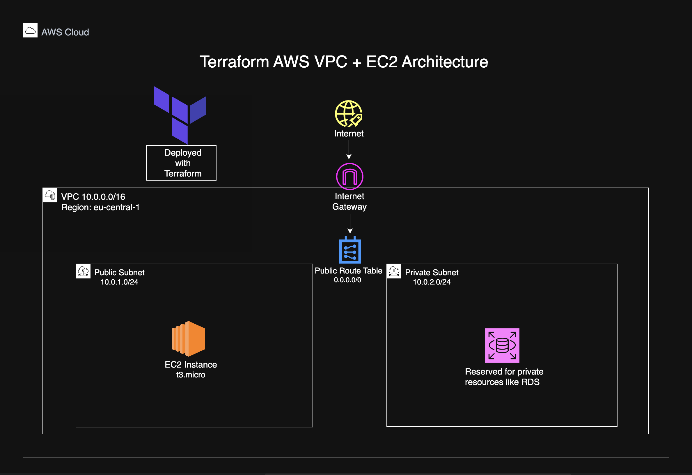
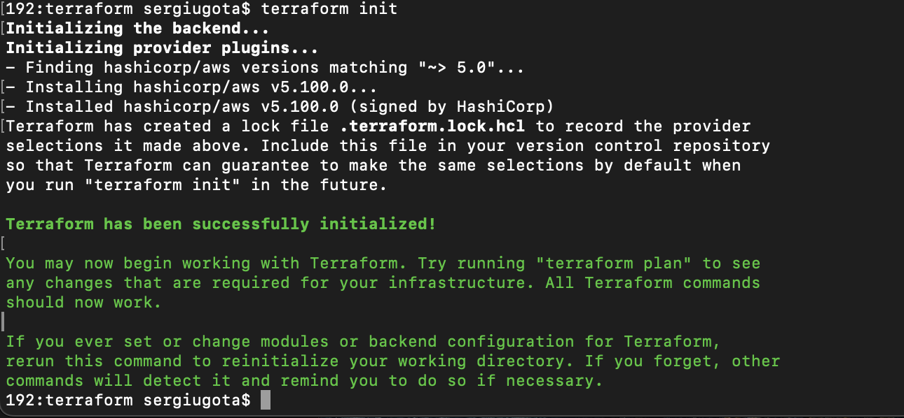
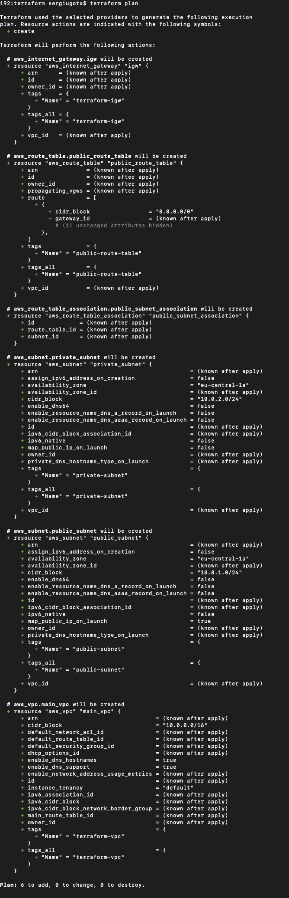
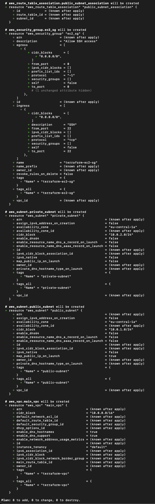
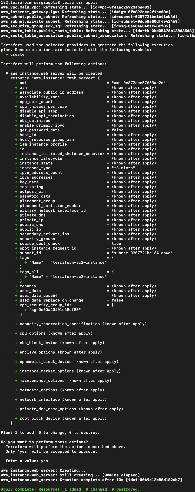
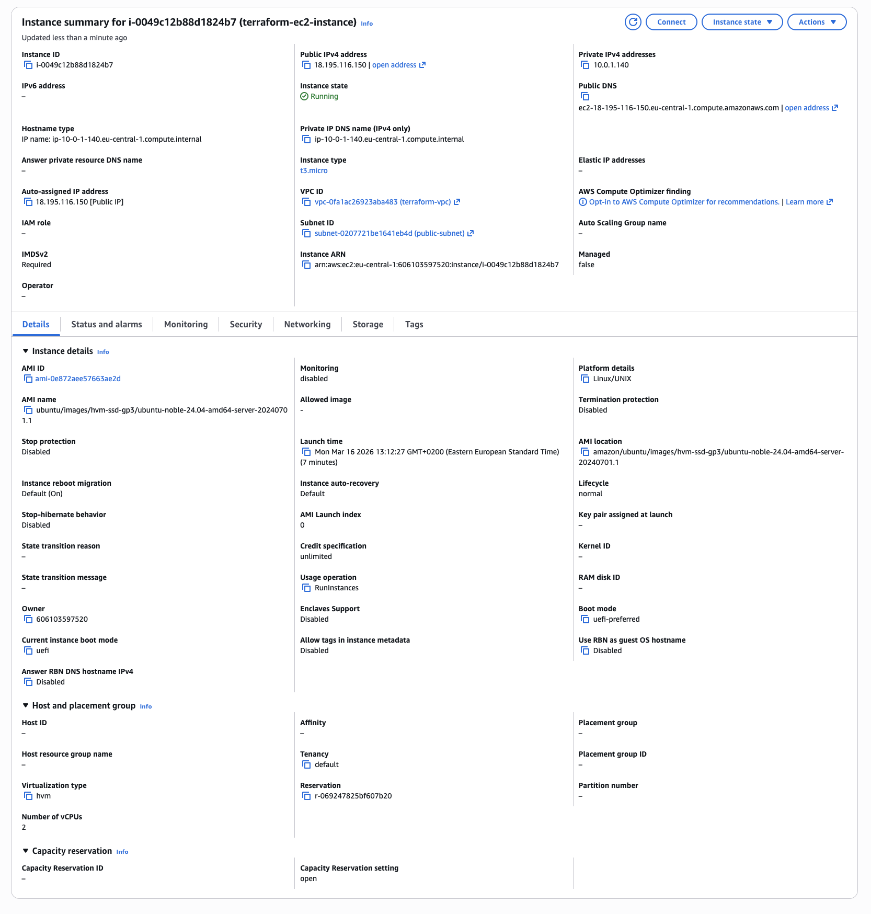
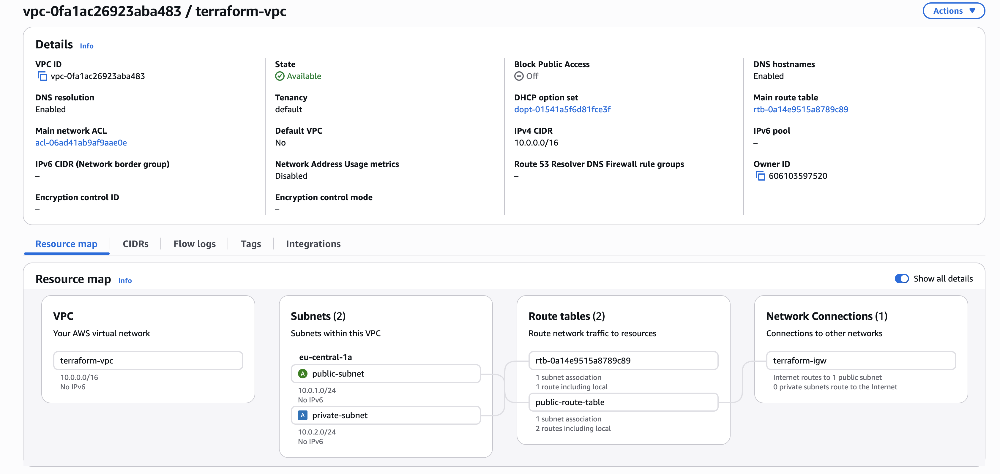
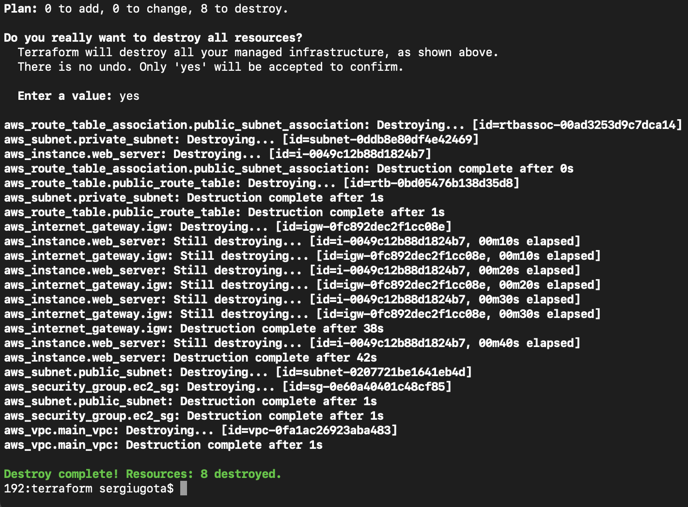

# Terraform Project: AWS VPC with Public & Private Subnets and EC2 Deployment

This project demonstrates how to provision a complete AWS networking environment using Terraform. The infrastructure includes a VPC, public and private subnets, an Internet Gateway, route tables, security groups, and an EC2 instance deployed inside the public subnet.

The goal of the project is to simulate a basic production-style infrastructure deployment using Infrastructure as Code.

---

# 1. Recommended Repository Structure

Every cloud project repository should follow a clear and organized structure.

```
terraform-aws-vpc-ec2
│
├── architecture
│   └── terraform-vpc-ec2-architecture.png
│
├── terraform
│   └── main.tf
│
├── screenshots
│   ├── 01-terraform-init.png
│   ├── 02-terraform-plan-preview.png
│   ├── 03-terraform-plan-summary.png
│   ├── 04-terraform-apply-success.png
│   ├── 05-ec2-instance-running.png
│   ├── 06-vpc-resource-map.png
│   └── 07-terraform-destroy-success.png
│
├── README.md
├── LICENSE
└── .gitignore
```

This structure separates infrastructure code, architecture documentation, and deployment proof.

---

# 2. Overview

This project provisions AWS infrastructure using Terraform.

The deployed resources include

Amazon VPC
Public Subnet
Private Subnet
Internet Gateway
Route Table
Route Table Association
Security Group
EC2 Instance

The project demonstrates Infrastructure as Code (IaC) principles and automated provisioning of networking components inside AWS.

---

# 3. Architecture

The infrastructure created in this project follows this flow

Internet
↓
Internet Gateway
↓
Public Route Table
↓
Public Subnet
↓
EC2 Instance

A second private subnet is also created to demonstrate how production architectures typically separate public and private resources.

---

# 4. Architecture Diagram

The architecture diagram illustrates the network structure created with Terraform.



Components

Internet Gateway provides internet access to the VPC

Public Subnet hosts internet-facing resources such as EC2 instances

Private Subnet is reserved for private services such as databases

Route Table routes traffic from the public subnet to the internet

Security Group controls inbound and outbound traffic

---

# 5. Technologies Used

AWS VPC
AWS EC2
AWS Internet Gateway
AWS Route Tables
AWS Security Groups
Terraform
Git
GitHub

---

# 6. Project Structure

```
architecture/
Contains architecture diagrams used to visualize the infrastructure.

terraform/
Contains the Terraform configuration used to deploy the infrastructure.

screenshots/
Contains proof of deployment including Terraform commands and AWS resources.

README.md
Project documentation.

LICENSE
Open source license for the project.

.gitignore
Files ignored by Git such as Terraform state files.
```

---

# 7. Deployment Workflow

The infrastructure was deployed using the standard Terraform workflow.

Initialize Terraform

```
terraform init
```

Preview infrastructure changes

```
terraform plan
```

Deploy infrastructure

```
terraform apply
```

Destroy infrastructure

```
terraform destroy
```

This workflow ensures infrastructure changes are predictable and repeatable.

---

# 8. Infrastructure Explanation

The Terraform configuration deploys the following AWS resources.

VPC
Creates an isolated virtual network using CIDR block 10.0.0.0/16.

Public Subnet
Subnet 10.0.1.0/24 used for internet-facing resources.

Private Subnet
Subnet 10.0.2.0/24 reserved for private infrastructure components.

Internet Gateway
Allows communication between the VPC and the internet.

Route Table
Routes outbound traffic from the public subnet to the Internet Gateway.

Security Group
Allows inbound SSH access on port 22.

EC2 Instance
A t3.micro EC2 instance deployed in the public subnet.

---

# 9. Screenshots (Deployment Proof)

# Terraform initialization



# Terraform plan preview



# Terraform plan summary



# Terraform apply success



# EC2 instance running



# VPC resource map



# Terraform destroy completed



These screenshots confirm the infrastructure was successfully deployed and later destroyed using Terraform.

---

# 10. Key Concepts Demonstrated

Infrastructure as Code

Terraform provisioning

AWS networking fundamentals

VPC design

Subnet segmentation

Security group configuration

Automated infrastructure lifecycle

---

# 11. Challenges Encountered

Problem
Ensuring the EC2 instance received a public IP address.

Cause
Instances launched inside a subnet without public IP mapping cannot be accessed from the internet.

Solution
Enabled automatic public IP assignment for the public subnet.

---

# 12. Lessons Learned

Infrastructure can be deployed and destroyed consistently using Terraform.

VPC networking design is a fundamental skill for cloud engineers.

Separating public and private subnets improves security and scalability.

Terraform provides a clear workflow for infrastructure lifecycle management.

---

# 13. Author

Sergiu Gota

AWS Cloud Engineer

GitHub
https://github.com/sergiugotacloud

